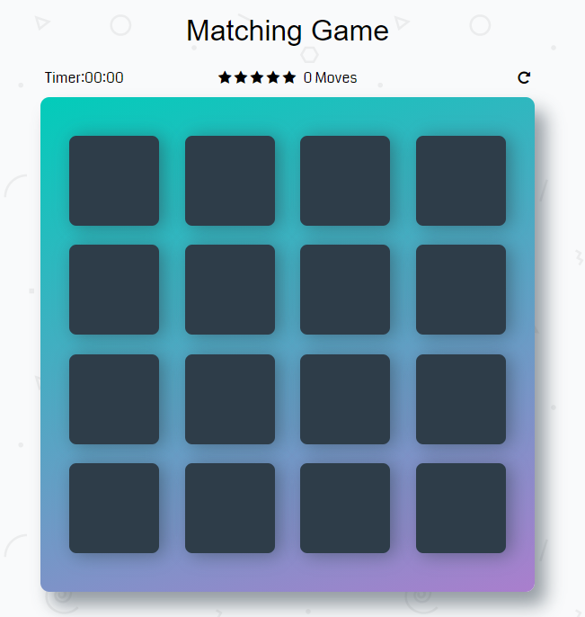

# Memory Game Project

## Table of Contents

  - [Live Project](https://leolikestocode.github.io/udacity-memory-game)
  - [Project Image](#project-image)
  - [Instructions](#instructions)
  - [Dependencies](#dependencies)
  - [Technologies!](#technologies)

## Project Image

## Instructions

 - To start the game, you have to click on a card, when that happens the timer will automatically begin.
 - The goal is to match all the cards to its 'sibling'.
 - When all the cards are matched the game is finished.
 - A modal appears so you can check your score.

## Dependencies
 - Font Awesome
 - Google Fonts
 - Bootstrap

## Technologies!

- HTML5
- CSS3
- Javascript